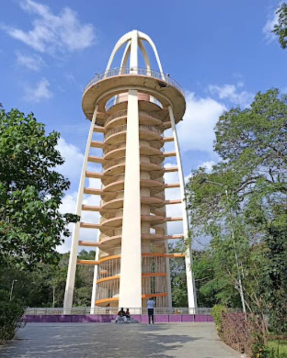
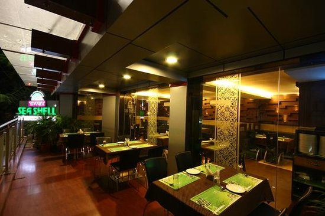
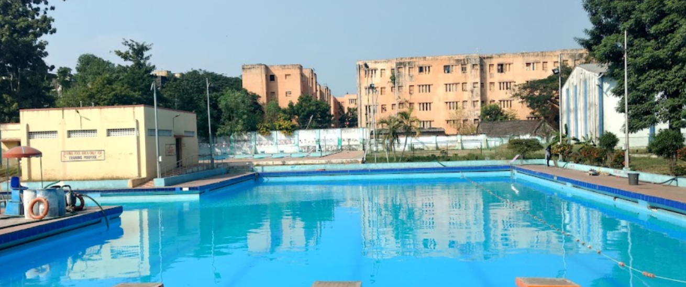
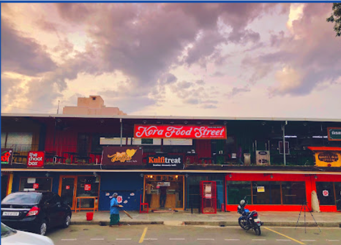

# Places Around Me
# NAME:KAMALESH
# REF NO:23001711
# DEPARTMENT:AIDS
# Aim:
To develop a website to display details about the places around my house.

# Design Steps:
## Step 1

Create a new django project and app

## Step 2

Add a new imagemap html file in templates and need images in static folder and define it in settings

## Step 3

complete all the steps and commit and push to github

## Code:
```html
<!DOCTYPE html>
<html>
    <head>
        <title>maps</title>
    </head>
    <body>
    <H1>places near my location</H1>
    
    <map name="navigation">
        <area shape="rect" coords="143,625,408,708" alt="ooo" href="annadharsh.html" title="annaadharsh">
        <area shape="rect" coords="724,241,939,339" alt="ok" href="seashell.html" title="seashell">
        <area shape="RECT" coords="100,327,311,436" alt="oi" href="korafoodstreet.html" title="korafood">
        <area shape="Rect" coords="483,305,711,387"  alt="lol" href="annatower.html" title="annatower">
        <area shape="rect"   coords="1111,6000,1359,689" alt="oo" href="swimmingpool.html" title="swimmingpool">
    </map>
    </body>
</html>
```
### adharsh.html
```html
<!DOCTYPE html>
<html>
    <head>ANNA ADHARSH</head>
    <body style="background-color:rgb(28, 255, 255);"align ="center">
        
        <h1 style="font-family:verdana;"> <u>ANNA ADHARSH</u></h1>
        <p style="color:rgb(165, 42, 42); font-size: 200%;" ><strong>To transform every woman student who leaves its portal into a humane, socially responsible and professionally successful individual who can envision her future and strive relentlessly towards perfection without compromising on moral and ethical values. </strong></p>
    </body>
</html>
```

### annatower.html
```html
<!DOCTYPE html>
<html>
    <head>ANNA TOWER</head>
    <body style="background-color:rgb(28, 255, 255);"align ="center">
        
        <h1 style="font-family:verdana;"> <u>ANNA TOWER</u></h1>
        <p style="color:rgb(165, 42, 42); font-size: 200%;" ><strong>It is one of the prime residential areas in Chennai and is home to several prominent doctors, lawyers and politicians. Real estate prices are among the highest in the city. A recent addition to the area is VR Chennai Mall, located near Shanthi Colony and Thirumangalam junction.
        </strong></p>
    </body>
</html>
```
### seashell.html
```html
<!DOCTYPE html>
<html>
    <head>SEASHELL</head>
    <body style="background-color:rgb(28, 255, 255);"align ="center">
        
        <h1 style="font-family:verdana;"> <u>SEASHELL</u></h1>
        <p style="color:rgb(165, 42, 42); font-size: 200%;" ><strong>Sea Shell in Thousand Lights, Chennai is a well-known restaurant that serves both local and non-local customers. The restaurant is known for its seafood and Arabian-style dishes. Some say the restaurant has great customer service and tasty food. Sea Shell Restaurant in Chennai is owned by the famous Tamil actor ARYA.  </strong></p>
    </body>
</html>
```
### swimmingpool.html
```html
<!DOCTYPE html>
<html>
    <head>SWIMMING POOL</head>
    <body style="background-color:rgb(28, 255, 255);"align ="center">
        
        <h1 style="font-family:verdana;"> <u>SWIMMING POOL</u></h1>
        <p style="color:rgb(165, 42, 42); font-size: 200%;" ><strong>A swimming pool is a tank or large basin that is filled with water and intended for recreational or competitive swimming or diving. Pools are also used for other bathing activities, such as playing, wading, water exercising, floating on inner tubes, or cooling off on hot days. </strong></p>
    </body>
</html>
```
### korafoodstreet.html
```html
<!DOCTYPE html>
<html>
    <head>KORA FOODSTREET</head>
    <body style="background-color:rgb(28, 255, 255);"align ="center">
        
        <h1 style="font-family:verdana;"> <u>KORA FOODSTREET</u></h1>
        <p style="color:rgb(165, 42, 42); font-size: 200%;" ><strong>Kora Food Street (KFS) is a food court in Anna Nagar, Chennai. It offers a variety of food options from around the world, including: Wood fired pizza, Birria tacos, Noodles, Momos, Boba tea, Indian, Arabian. Some say the food is delicious and affordable, and that the chefs create multi-cuisine street food specials. KFS is open 24/7. </strong></p>
    </body>
</html>
```

# Output:


# annaadharsh.html


# korafoodstreet.html


# seashell.html


# swimmingpool.html


# annatower.html


# Result:
hence the output is verified

